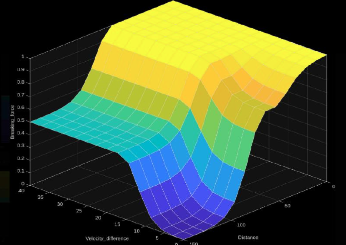
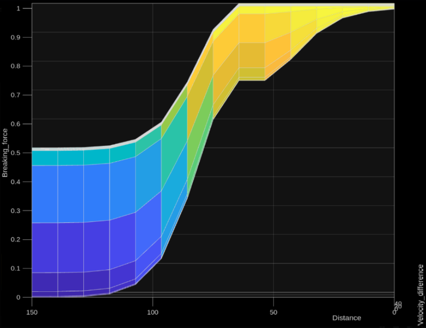

# VASC: Vehicle Autonomous Safety Controller

VASC is a multi-layered **Autonomous Emergency Braking (AEB)** and **Advanced Driver Assistance System (ADAS)** prototype implemented in the MATLAB R2024 / Simulink environment. Designed by blending fuzzy logic control, dynamic kinematic thresholds, and structural spatial verification.

This project was developed as a qualifying task for the **RCDC 2026** competition (VASC Category). 

> 🥈 **Finalists & 2nd Place Winners**
> * **The Funnel:** Out of **48 competing teams** our system was selected as **1 of the 8 exclusive finalists** to advance to the grand finals.
> * **The Grand Finals:** Competing with the topic name "Error Driver Not Found", we decided to upgraded the architecture to feature a live driver monitoring system (detecting operator sanity, attentiveness, and drowsiness factors), ultimately securing **2nd Place Overall**.
> * **Finals Repository:** The complete driver-state monitoring implementation developed during the final stage can be found at [Error Driver Not Found - Finals Repo](https://github.com/firiusz123/Error_Driver_not_found.git).

## 👥 Authors (Team: Maths DosentWork)
* Michał Domański
* Eryk Pawełek
* Hubert Miklas
* Phillip Rzeszótko

---

## 🛠 Key Innovations & Features

* **Hybrid Decision System:** Combines a **Sugeno Fuzzy Logic Controller (FLC)** for smooth brake force modulation with deterministic **Automatic Emergency Detection (AED)** based on the developed FSM.
* **Dynamic TTC Thresholding:** Replaces rigid Time-To-Collision (TTC) constraints with an adaptive threshold scaled natively against the ego vehicle's velocity.
* **Spatial Verification Layer ($distF$):** Integrates double-integral predictive calculation paths to compute real-time remaining gap clearances, accounting for dynamic host/target acceleration changes.
* **ISO 26262 Alignment:** Adheres to rigorous functional safety practices featuring strict structural modularity, comprehensive FSM (Finite State Machine) state-return pathways, and centralized configuration scripting.

---

## 📐 System Architecture

The core model topology establishes a closed-loop system mapping the signal pathway seamlessly from raw sensor processing to physical braking actuation.
```
[Raw Radar Sensor] ──> [Radar Filter] ──> [Moving Average] ──> [VASC Core Algorithm] ──> [Brake Actuator Amp/Integrator] ──> [Ego Velocity Update]
```

### Modular Breakdown
The inner core is separated into four isolated subsystems to optimize testability and maintainability matching standard automotive ECU requirements:
1. **Moving Average:** Cleans high-frequency spikes and impulse noise from the target tracking array[cite: 50, 74, 75].
2. **TTC_calc:** Processes kinematic time frameworks.
3. **distF_calc:** Executes predictive spatial positioning equations.
4. **AEB Logic:** Houses the final multi-variable command arbitration.

---

## 🔢 Kinematics & Mathematical Foundations

### 1. Dynamic Time-To-Collision Threshold
Instead of static triggers, the critical activation limit adjusts linearly to physical demands[cite: 83, 89]:

$$TTC_{threshold} = \frac{v_{ego}}{max\_deceleration} + minimal\_breaking\_time\_buffer$$

Where:
* $\frac{v_{ego}}{max\_deceleration}$ represents the absolute physical minimum time required to decelerate the vehicle to a full halt from its current velocity given a max performance ceiling of $8~m/s^2$[cite: 92].
* $minimal\_breaking\_time\_buffer = 3~\text{s}$ serves as an instrumentation cushion covering system latency, mechanical delay, and safety margins.

### 2. Spatial Predicted Gap Clearance ($distF$)
To safeguard against scenarios where standard linear TTC equations fall short (e.g., tailgating vehicle interactions where the leading asset is also decelerating rapidly), the system maps absolute traveled paths:

$$S_{ego} = \int_{t_1}^{t_2} v_{ego}(t) \, dt$$

$$S_{lead} = \int_{t_1}^{t_2} v_{lead}(t) \, dt$$

$$distF = distance + S_{lead} - S_{ego}$$

> 💡 **Interpretation:** If $distF > 0$, the vehicle safely maintains an operational buffer zone post-event. If $distF \le 0$, a collision boundary is breached, mandating overrides.

---

## 🧠 Decision Logic & Fuzzy Inference

VASC deploys a **Sugeno (Takagi-Sugeno-Kang) Fuzzy Controller** due to its high computational efficiency, deterministic crisp outputs, and ease of deployment on real-world automotive ECUs.

The surface of the controller:
<p align="center">
  
</p>
<p align="center">
  
</p>

### Membership Functions (MF) & Inputs
The controller screens two main parameters: **Velocity Difference** ($v_{lead} - v_{ego}$, saturated to non-negative vectors ensuring focus solely on closing scenarios) and **Distance**.

* **Velocity Difference [$0$ to $40~m/s$]:** 
    * `S_V_diff` (Small): Trapmf $[0, 0, 8, 15]$ $\rightarrow$ Controlled closing $\le 8~m/s$.
    * `M_V_diff` (Medium): Gaussmf $[\sigma=4, c=16]$ $\rightarrow$ Elevating convergence $\approx 16~m/s$.
    * `L_V_diff` (Large): Trapmf $[15, 22, 40, 40]$ $\rightarrow$ Critical closing $\ge 22~m/s$.
* **Distance [$0$ to $150~\text{m}$]:** 
    * `S_dist` (Small): Trapmf $[0, 0, 25, 50]$ $\rightarrow$ Immediate threat $\le 25~\text{m}$.
    * `M_dist` (Medium): Gaussmf $[\sigma=20, c=60]$ $\rightarrow$ Monitoring transition $\approx 60~\text{m}$.
    * `L_dist` (Large): Trapmf $[70, 100, 150, 150]$ $\rightarrow$ Safe zone $\ge 100~\text{m}$.

### Fuzzy Rule Matrix (Crisp Output Forces) [cite: 146, 147]

| Distance / $\Delta V$ | S (Small) | M (Medium) | L (Large) |
| :--- | :--- | :--- | :--- |
| **S (Small)** | Full (1.00)  | Full (1.00)  | Full (1.00)  |
| **M (Medium)** | Med_Small (0.25)  | Med_Large (0.75)  | Full (1.00)  |
| **L (Large)** | Zero (0.00)  | Med_Small (0.25)  | Full (1.00)  |

*Note: The system undergoes rigorous iterations (`fuzzy_controller2.fis`), settling on an aggressive response behavior at small margins alongside a highly conservative fallback that triggers maximum force even at long range if closing speeds are critical.*

---

## 🕹 Finite State Machine (FSM)

The system behavior loops through four distinct states, ensuring every state maintains an explicit path back to standard operations (`IDLE`), eliminating software deadlocks[cite: 171, 172, 223].
```text

     ┌───────────────┐
┌───>│     IDLE      │<──────────────────────────────┐
│    └───────┬───────┘                               │
│            │ Object Detected &&                    │
│            │ TTC < TTC_W                           │
│            ▼                                       │
│    ┌───────────────┐                               │
│    │    WARNING    │                               │
│    └───────┬───────┘                               │
│            │ TTC < TTC_A ||                        │
│            │ Spatial Boundary Faulted (k)          │
│            ▼                                       │
│    ┌───────────────┐     TTC < TTC_Threshold &&    │
│    │      AEB      │───> AED_overtake == True      │
│    └───────┬───────┘                               │
│            │                                       │
│            │ v_ego <= v_lead                       │
│            ▼                                       │
│    ┌───────────────┐                               │
│    │   OVERTAKE    │───────────────────────────────┘
└────│ (Special Mode)│
     └───────────────┘

```
### Functional Transitions
* **IDLE $\rightarrow$ WARNING:** Activates Forward Collision Warning (FCW) indicator panel when a verified threat falls under the target visibility horizon ($TTC_W = 2 \cdot TTC_{threshold}$)[cite: 196, 204, 206]. Braking elements remain disengaged[cite: 206].
* **WARNING $\rightarrow$ AEB:** Active when $TTC$ drops below critical bounds ($TTC_A$) or spatial margins fail safety thresholds ($k = \frac{v_{diff}^2}{7} + 20$). FLC takes over proportional braking pressure.
* **AEB $\rightarrow$ IDLE:** Gracefully releases actuator pressure once host velocity drops below target values ($v_{ego} \le v_{lead}$), signaling hazard neutralization.

---

## ⚙ System Configuration Parameters

All central parameters are managed in the `init_ADAS.m` initialization script to preserve clean model abstraction without hardcoded block limits[cite: 309, 310]:

| Parameter | Default Value | Unit | Functional Description |
| :--- | :--- | :--- | :--- |
| `v_ego` (start) | $40$ | $m/s$ | Host initial speed ($144~km/h$ highway testing benchmark)  |
| `v_lead` (start)| $20$ | $m/s$ | Target asset speed ($72~km/h$)  |
| `d_init` | $25$ | $\text{m}$ | Worst-case initialization proximity offset  |
| `max_deceleration`| $8$ | $m/s^2$ | Maximum physical deceleration performance (ECE R13)  |
| `radar_max_range`| $150$ | $\text{m}$ | Maximum sensor scanning range ($77~\text{GHz}$ automotive standard)  |
| `tau_radar` | $0.02$ | $\text{s}$ | Low-pass filter time invariant constant ($20~\text{ms}$ delay profile)  |
| `fs` | $100$ | $\text{Hz}$ | Operational sensor step clock cycle rate ($10~\text{ms}$ step window)  |
| `AED_overtake` | `false` | `bool` | Explicit flag controlling passing overrides  |

---

## 📈 Visual Validation Frameworks

Post-execution, `init_ADAS.m` aggregates visualization metrics automatically into two specialized engineering interfaces:

### 1. Comprehensive Diagnostics Panel (2x2 Grid) 
* **Relative Distance ($m$):** Evaluates profile deceleration curves mapping out the final target gap structure[cite: 323].
* **TTC ($s$):** Tracks system tracking trends showing step-wise recovery metrics post-actuation.
* **Vehicle Velocities ($m/s$):** Superimposes $v_{ego}$ directly onto $v_{lead}$ verifying perfect speed match transitions without collisions.
* **Braking Force ($0-1$):** Verifies the smoothness of the FLC response profile, confirming the absence of block instabilities.

### 2. Safety Proof Verification
Plots **Relative Distance** concurrently against **Real Braking Distance ($distF$)**[cite: 325]. So long as the calculated $distF$ line stays clear above zero throughout the simulation cycle, it provides definitive validation that the host vehicle remained outside collision boundaries—adhering directly to official Euro NCAP verification standards.

---

## 🚀 Future Roadmap & Scaling Extensions

The modular architecture allows developers to modify parameters and introduce features without changing the underlying safety state logic:

1. **Dynamic Friction Adaptation ($\mu$):** Interfacing directly with internal ABS/ESP modules to dynamically scale `max_deceleration` from $8.0~m/s^2$ (dry pavement) down to $1.5~m/s^2$ (ice conditions), automatically extending warning times.
2. **Aquaplaning Mitigation Modalities:** Tracking individual wheel-slip differentials to detect aquaplaning risks ($\mu \approx 0.05$), replacing sharp spike stops with progressive speed reductions to restore tire contact patches[cite: 362, 368, 372].
3. **Smooth Stop Adjustments ("Limousine Mode"):** Utilizing extra inputs such as "available time reserve" ($TTC - TTC_{threshold}$) and rate limiters to bound acceleration derivatives (jerk limiting), minimizing passenger discomfort when conditions allow.
4. **Multi-Sensor Weather Data Fusion:** Incorporating deep optical vision configurations to cross-examine sensor matrices under adverse weather conditions.